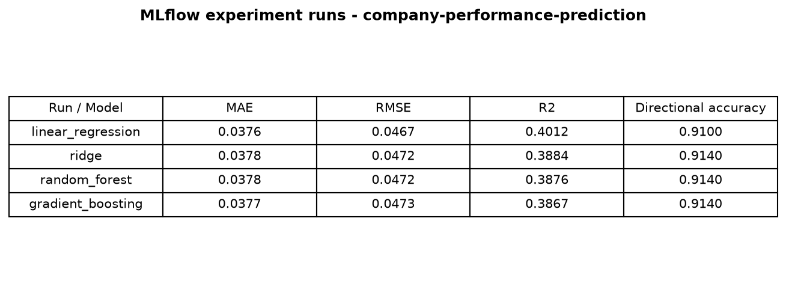
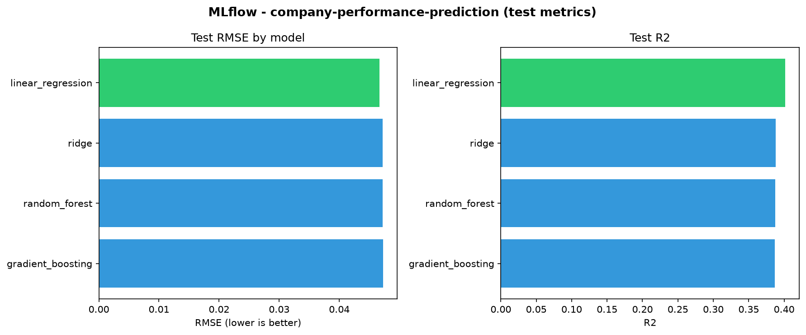

# Company Performance Prediction: MLOps Pipeline

**Course:** MLOps and System Design (EADA, 2026)

---

## 1. Problem Statement and Analysis

### 1.1 Problem description

We predict each company's **next-year revenue growth** from its current-year fundamentals, stock behaviour, and macroeconomic context. Each row in the dataset is one **(company, fiscal_year)** pair at year **t**; the label is performance in year **t+1**.

The business question: *given what we know about a company today, how will its revenue grow next year?*

### 1.2 Problem type

**Regression.** The target is a continuous ratio:

`target_revenue_growth = revenue_{t+1} / revenue_t - 1`

We also support alternative targets in `config.yaml` (net-income growth, operating margin) but the final model uses revenue growth.

### 1.3 System design decisions

| Topic | Decision | Rationale |
|---|---|---|
| **Data source** | yfinance + FRED (live APIs) | Real fundamentals, prices, and macro indicators for configured tickers |
| **Universe** | ~168 large-cap tickers (US, Europe, Japan), fiscal years 2018-2026 | Coverage depends on API availability per ticker |
| **Latency** | **Batch / offline** (minutes acceptable) | This is not a real-time trading system. Fetch may take minutes with live APIs; training and prediction run in seconds. No sub-second SLA is required. |
| **Serving model** | Batch scoring via `python main.py predict` | Matches course "on-demand" workflow: load a CSV, write predictions to disk |
| **Train/test split** | Chronological holdout (train 2018-2022, test 2023) | No shuffle; simulates forecasting on future data |
| **Forward scoring** | Feature year 2025, predict 2026 | Separate production-style batch, distinct from the 2023 evaluation holdout |
| **Leakage control** | Features use year **t** only; targets from year **t+1** via `shift(-1)` per company | Prevents future information entering the model |
| **Experiment tracking** | MLflow (`sqlite:///mlflow.db`) | Compare models and satisfy course tracking requirement |
| **Model selection** | Lowest test RMSE on chronological holdout | Simple, auditable criterion |
| **Complexity** | Linear models preferred over tree ensembles when test performance is comparable | Random Forest overfit badly (train R² 0.85, negative test R²); Ridge generalised best |

### 1.4 Pipeline overview

```
fetch  →  features  →  train  →  predict
```

1. **`fetch`**: download raw snapshots from yfinance and FRED into `datasets/raw/`.
2. **`features`**: engineer leakage-safe features; write `features.csv` and the on-demand scoring set.
3. **`train`**: compare four sklearn models with MLflow; persist the best model by test RMSE.
4. **`predict`**: score `batch_prediction_dataset/on_demand_dataset.csv` and write predictions.

---

## 2. Version Control

The project is hosted on **GitHub** and shared with the professor for review.

### 2.1 Branching strategy

| Branch | Purpose |
|---|---|
| `main` | Stable, deployable code; CD retrains models on push |
| `development` | Integration branch for merged feature work |
| `feat/*` | Short-lived feature branches per teammate / deliverable |

Examples used during development: `feat/project-structure`, `feat/features-and-data`, `feat/model-training`, `feat/Tests-predict-CI/CD`.

### 2.2 Workflow

1. Create a `feat/*` branch from `development`.
2. Implement one scoped deliverable per branch.
3. Open a **pull request** into `development` or `main`.
4. **CI** runs flake8 and pytest (including a live fetch) on every PR to `main`.
5. Merge after review; CD runs on push to `main`.

### 2.3 Commit conventions

Commits use prefixes such as `feat:`, `fix:`, `chore:`, `test:`, `ci:`, and `docs:` to describe the type of change.

---

## 3. Model Training and Experiment Tracking

### 3.1 Data transformations

Documented in `src/features/build_features.py` and summarised here:

| Step | Transformation |
|---|---|
| Load raw panel | Merge fundamentals, stock, and macro snapshots |
| Profitability | `gross_margin`, `operating_margin`, `net_margin` from income-statement line items |
| Returns | `roa`, `roe` |
| Leverage / liquidity | `debt_to_equity`, `current_ratio` |
| Cash / efficiency | `fcf_margin`, `asset_turnover` |
| Dynamics | `prior_revenue_growth` (lagged within company) |
| Market | `annual_return`, `annual_volatility`, `log_market_cap` |
| Macro | `gdp_growth`, `dgs10`, `cpi`, `unrate` |
| Targets | `target_*` columns via `shift(-1)` per `company_id` (never used as features) |

Output: `datasets/processed/features.csv` (live panel rows with complete features, zero NaNs).

### 3.2 Models compared

All models use **`StandardScaler` + estimator**:

- Linear Regression
- Ridge Regression
- Random Forest Regressor
- Gradient Boosting Regressor

We deliberately avoided overly complex models. Tree ensembles use shallow, regularised settings (`max_depth`, `min_samples_leaf`) to limit overfitting. Hyperparameters are defined in `config.yaml` under `training.hyperparameters`.

### 3.3 Performance metrics

Each model is evaluated on four metrics:

| Metric | Description |
|---|---|
| **MAE** | Mean absolute error |
| **RMSE** | Root mean squared error (model selection criterion) |
| **R²** | Coefficient of determination |
| **Directional accuracy** | Share of predictions with the correct sign vs. actual |

### 3.4 Test-set results (holdout year 2023)

| Model | MAE | RMSE | R² | Directional accuracy |
|---|---|---|---|---|
| **Linear Regression** | **0.0376** | **0.0467** | **0.401** | **0.910** |
| Ridge Regression | 0.0378 | 0.0472 | 0.388 | 0.914 |
| Random Forest | 0.0378 | 0.0472 | 0.388 | 0.914 |
| Gradient Boosting | 0.0377 | 0.0473 | 0.387 | 0.914 |

*Source: `models/metadata.json`, test partition, fiscal year 2023.*

### 3.5 Chosen model

**Linear regression** was selected (lowest test RMSE: **0.0467**, test R² **0.40**). With tuned, regularised tree models, all four candidates perform similarly on the holdout; the simple linear model generalises best by RMSE while staying easy to interpret.

### 3.6 MLflow and Jupyter

- **MLflow**: experiment `company-performance-prediction`, tracking URI `sqlite:///mlflow.db`
- **Notebook**: `notebooks/model_experiments.ipynb` rebuilds features, runs training, and compares models

```bash
mlflow ui --backend-store-uri sqlite:///mlflow.db
```





---

## 4. Project Structure

```
main.py                          # CLI entrypoint
config.yaml                      # paths, tickers, hyperparameters
requirements.txt                 # pinned dependencies
documentation.md                 # this file
src/
  utils.py                         # load_config, logging helpers
  data/fetch.py                    # data ingestion
  features/build_features.py       # feature engineering
  models/train.py                  # training + MLflow logging
  models/predict.py                # on-demand batch scoring
datasets/
  raw/                             # fundamentals, stock, macro CSVs (generated by fetch)
  processed/                       # features.csv (generated by features)
models/                            # model.joblib, metadata.json
batch_prediction_dataset/          # on_demand_dataset.csv, on_demand_predictions.csv
tests/test_pipeline.py             # pytest suite (live fetch)
notebooks/model_experiments.ipynb  # experiment notebook
.github/workflows/
  ci.yml                           # lint + pytest on pull_request
  cd.yml                           # fetch + features + train on push to main
```

### 4.1 Dependencies

All dependencies are pinned in `requirements.txt` (pandas, scikit-learn, mlflow, pytest, etc.).

### 4.2 Running on the professor's machine

Requires network access for `fetch` and pytest:

```bash
python -m venv .venv && source .venv/bin/activate
pip install -r requirements.txt
python main.py all
pytest tests/ -v
```

---

## 5. CI/CD Pipeline

### 5.1 Continuous Integration (`.github/workflows/ci.yml`)

| Setting | Value |
|---|---|
| **Trigger** | Pull request to `main` |
| **Steps** | `pip install` → flake8 → `pytest` (live fetch) |
| **Network** | Required (yfinance + FRED) |

### 5.2 Continuous Deployment (`.github/workflows/cd.yml`)

| Setting | Value |
|---|---|
| **Trigger** | Push to `main` |
| **Steps** | `python main.py fetch` → `features` → `train` |
| **Artifact** | Commits updated `models/model.joblib` and `models/metadata.json` back to the repo |

---

## 6. On-Demand Workflow

The course requires a batch prediction workflow using a dataset in `batch_prediction_dataset/`.

| Item | Path |
|---|---|
| **Input** | `batch_prediction_dataset/on_demand_dataset.csv` (feature year 2025) |
| **Output** | `batch_prediction_dataset/on_demand_predictions.csv` |
| **Command** | `python main.py predict` |

The predict step loads the trained model from `models/`, scores every row in the on-demand dataset, and writes `predicted_revenue_growth` plus `predicted_for_year: 2026` to the output file in the **same directory**.

```bash
python main.py predict
```

---

## 7. Conclusions

We delivered a reproducible batch MLOps pipeline with:

- Live data ingestion from yfinance and FRED
- Documented, leakage-safe feature engineering
- Four-model comparison tracked in MLflow
- Linear regression as the final model (test RMSE 0.0467, test R² 0.40, directional accuracy 91.0%)
- CI on pull requests and CD that retrains and commits model artifacts
- On-demand batch predictions (2025 features → 2026 revenue growth)

The project prioritises **pipeline mechanics, reproducibility, and documentation** over forecasting accuracy, as required by the course.
